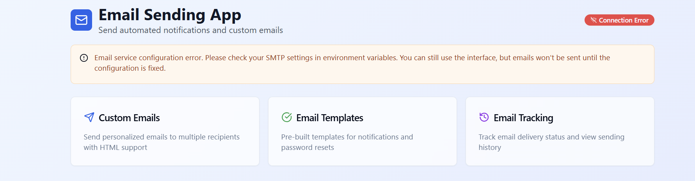

x # Email App

A modern, full-stack email application built with React, TypeScript, Vite, and Tailwind CSS. This project features a client-side interface for composing, sending, and viewing email history, as well as a server-side API for handling email operations.

## Features

- Compose and send emails
- View email history
- Responsive UI with reusable components
- Serverless backend functions (Netlify)
- TypeScript for type safety
  

## Project Structure

Email App is a modern, full-stack web application designed to simplify email communication. Built with React, TypeScript, Vite, and Tailwind CSS on the frontend, and Node.js/Express with serverless Netlify functions on the backend, this project demonstrates a scalable, maintainable, and visually appealing approach to building email-based productivity tools.

```
email-App/

This application allows users to compose, send, and view the history of emails through a clean and responsive interface. It is ideal for learning full-stack development, rapid prototyping, or as a foundation for more advanced messaging or notification systems.
│   ├── routes/       # API route handlers
│   └── index.ts      # Server entry point
├── netlify/          # Netlify serverless functions
├── shared/           # Shared code between client and server
├── public/           # Static assets
├── package.json      # Project dependencies
├── tailwind.config.ts# Tailwind CSS config
└── README.md         # Project documentation

```

## Getting Started

### Prerequisites

- Node.js (v18+ recommended)
- npm or yarn

### Installation

1. Clone the repository:
<p align="center">
  
</p>

# Email App

```sh
git clone https://github.com/kiganyamburu/email-App.git
cd email-App
```

2. Install dependencies:
   ```sh
   npm install
   # or
   yarn install
   ```

### Running the App

#### Development

- Start the Vite dev server:
  ```sh
  npm run dev
  ```
- The app will be available at `http://localhost:5173` by default.

#### Build

- To build the app for production:
  ```sh
  npm run build
  ```

1. **Compose an Email:**

- Navigate to the Compose section and fill in the recipient, subject, and message.
- Click Send to dispatch your email.

2. **View Email History:**

- Access the Email History page to see a list of previously sent emails, including timestamps and details.

3. **Customize UI:**

- Modify or extend UI components in `client/components/ui/` to fit your needs.

````


Contributions are welcome! If you have suggestions, bug reports, or want to add features, please open an issue or submit a pull request. For major changes, discuss them in an issue first.
#### Serverless Functions


This project is licensed under the [MIT License](LICENSE).
- Netlify functions are located in `netlify/functions/`.
- To test locally, use Netlify CLI:
```sh
npm install -g netlify-cli
netlify dev
````

## Configuration

- Email configuration details can be found in `EMAIL_CONFIG.md`.
- Update environment variables as needed for your email provider.

## Contributing

Pull requests are welcome! For major changes, please open an issue first to discuss what you would like to change.

## License

[MIT](LICENSE)
